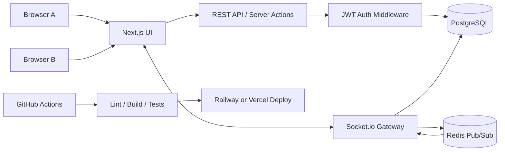
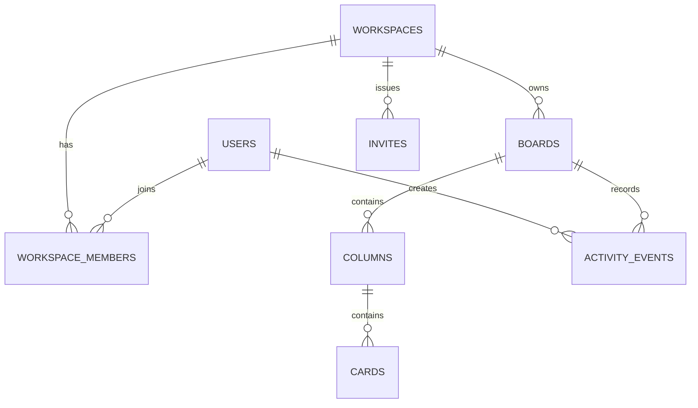

# LiveBoard

LiveBoard is a real-time collaborative task manager built to demonstrate production-style full-stack engineering: live board updates, workspace permissions, JWT auth, PostgreSQL persistence, Redis pub/sub, Docker-based local services, and CI-ready tests.

> Portfolio status: Phase 2 is complete at code level. The frontend preview, Prisma schema, demo seed, JWT auth, workspace/board/column/card/invite APIs, permission checks, docs, environment example, Docker Compose services, and local lint/build checks are ready. Socket.io, Redis realtime fanout, full automated API tests, deployment, and realtime GIF capture are the next implementation milestones.

## Live Links

| Resource | Link |
| --- | --- |
| Live demo | Coming after deployment |
| Desktop preview | [`docs/screenshots/dashboard.png`](docs/screenshots/dashboard.png) |
| Mobile preview | [`docs/screenshots/mobile-board.png`](docs/screenshots/mobile-board.png) |
| Realtime demo GIF | Coming after Socket.io flow is implemented |
| Architecture diagram | [`docs/architecture.mmd`](docs/architecture.mmd) |
| Schema diagram | [`docs/schema.mmd`](docs/schema.mmd) |
| API overview | [`docs/api-overview.md`](docs/api-overview.md) |

## Features

### Product Features

- Workspace dashboard for teams and boards.
- Trello-style board with columns and draggable cards.
- Live presence indicators for online teammates.
- Activity stream for board movement and collaboration events.
- Workspace invites and role-based access for owner, admin, and member roles.

### Engineering Features

- Next.js App Router and TypeScript frontend.
- REST API for durable auth, workspace, board, column, card, and invite state changes.
- Planned Socket.io rooms for board-specific realtime updates.
- Planned Redis pub/sub for multi-instance event fanout.
- PostgreSQL schema for users, workspaces, boards, columns, cards, invites, and activity events.
- Docker Compose for local PostgreSQL and Redis.
- Portfolio checklist for GitHub readiness in [`docs/github-portfolio-standard.md`](docs/github-portfolio-standard.md).

## Architecture



## Schema Diagram



Full ERD: [`docs/schema.mmd`](docs/schema.mmd)

## API Route Overview

The backend will use REST endpoints for persistent state and Socket.io events for realtime board updates.

- Auth: `POST /api/auth/register`, `POST /api/auth/login`, `GET /api/auth/me`
- Workspaces: `GET /api/workspaces`, `POST /api/workspaces`, `POST /api/workspaces/:workspaceId/invites`
- Boards: `GET /api/boards/:boardId`, `POST /api/workspaces/:workspaceId/boards`
- Columns: `POST /api/boards/:boardId/columns`, `PATCH /api/columns/:columnId`
- Cards: `POST /api/columns/:columnId/cards`, `PATCH /api/cards/:cardId`, `DELETE /api/cards/:cardId`
- Invites: `POST /api/workspaces/:workspaceId/invites`, `POST /api/invites/:token/accept`
- Realtime: `board:join`, `presence:update`, `card:moved`, `card:updated`, `activity:created`
- Health: `GET /api/health`

Full route table: [`docs/api-overview.md`](docs/api-overview.md)

## Screenshots

### Desktop Preview


### Mobile Preview


Realtime two-browser GIF capture is intentionally deferred until Phase 3, after Socket.io rooms and Redis pub/sub are implemented.

## Environment Variables

Copy `.env.example` to `.env.local` and replace placeholder values.

```bash
cp .env.example .env.local
```

Important variables:

- `DATABASE_URL`
- `REDIS_URL`
- `JWT_SECRET`
- `NEXT_PUBLIC_APP_URL`

Never commit `.env.local` or real credentials.

## Local Setup

```bash
npm install
docker compose up -d
npm.cmd run db:migrate
npm.cmd run db:seed
npm run dev
```

Then open `http://localhost:3000`.

## Seed / Demo Credentials

These are safe demo accounts created by the seed script:

| Role | Email | Password |
| --- | --- | --- |
| Admin | `admin@liveboard.dev` | `LiveBoardDemo123!` |
| Member | `member@liveboard.dev` | `LiveBoardDemo123!` |

The seed script creates one workspace, one board, four columns, demo cards, and an activity event.

## Testing

Current checks:

```bash
npm.cmd run db:generate
npm.cmd run lint
npm.cmd run build
```

Planned checks:

```bash
npm run test
npm run test:api
npm run test:socket
```

Acceptance scenarios before portfolio launch:

- Two users can log in with demo credentials.
- Authenticated users can create workspaces, boards, columns, cards, and invites through REST APIs.
- A card moved through the API persists its target column and position.
- Card order persists after reload.
- Unauthorized users cannot access private workspaces.
- Health check confirms database and Redis connectivity.

## Deployment

Recommended deployment:

- Frontend/app: Vercel or Railway.
- PostgreSQL: Railway, Supabase, Neon, or Vercel Marketplace database.
- Redis: Railway or Upstash.
- Secrets: deployment provider environment variables only.

Add the deployment URL to this README after the app is live.

## Roadmap

- Phase 1 complete: frontend preview, documentation, env example, Docker Compose, screenshots, lint, and build.
- Phase 2 complete: auth, database schema, seed script, workspace APIs, board/column/card APIs, invite APIs, and permission checks.
- Phase 3: add Socket.io gateway, board rooms, Redis pub/sub, presence, realtime movement, and persistence.
- Phase 4: add API/socket/frontend tests, realtime GIF, README final polish, and GitHub profile/pinned repo updates.
- Phase 5: deploy production demo and add the live URL to README and CV.
