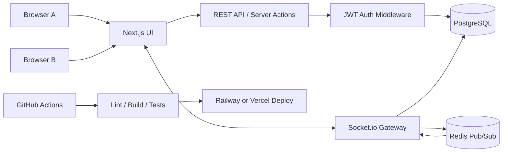
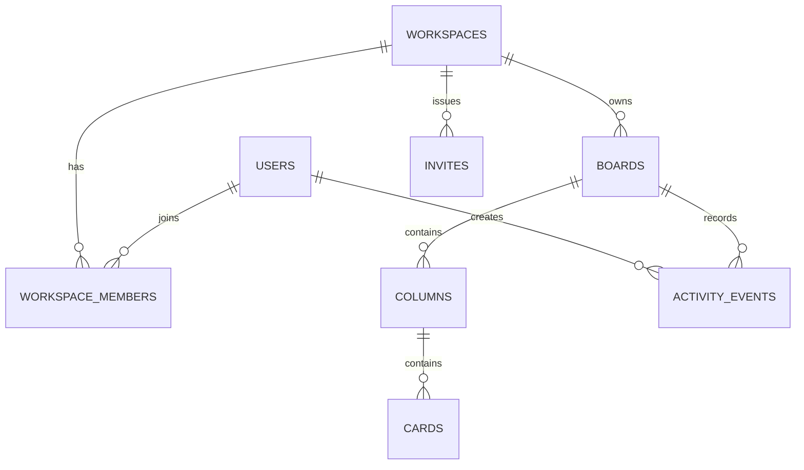
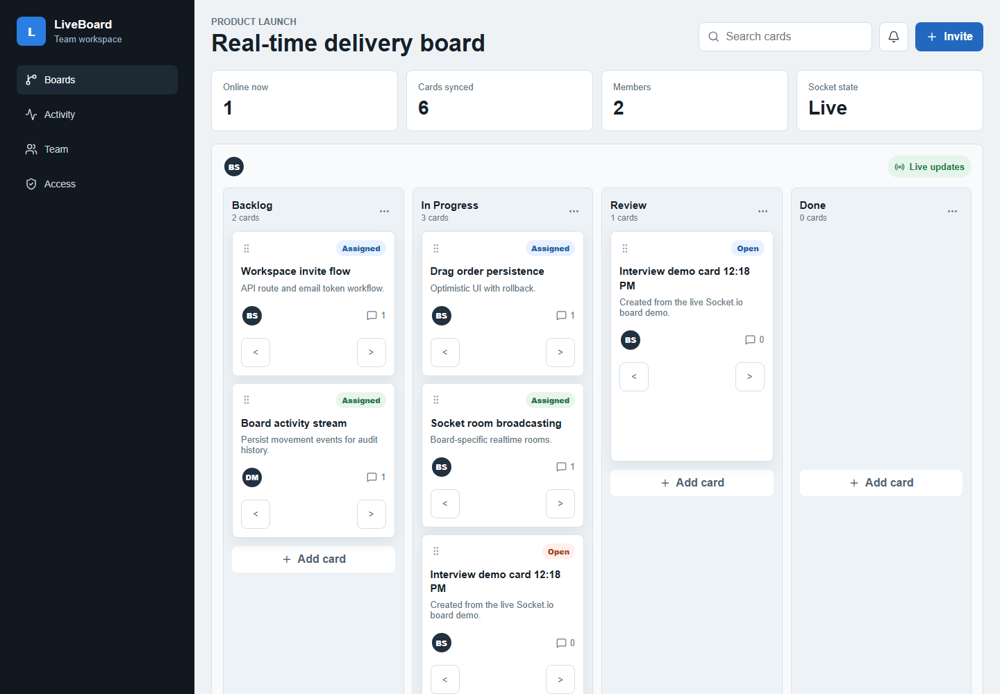
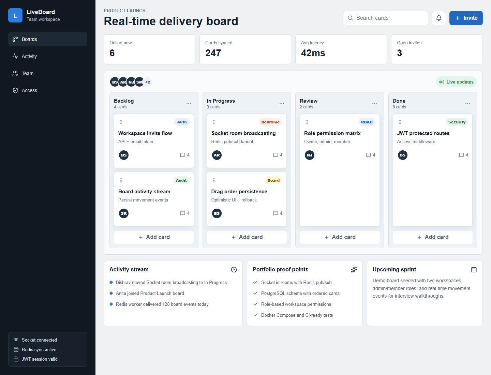
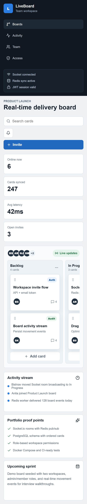
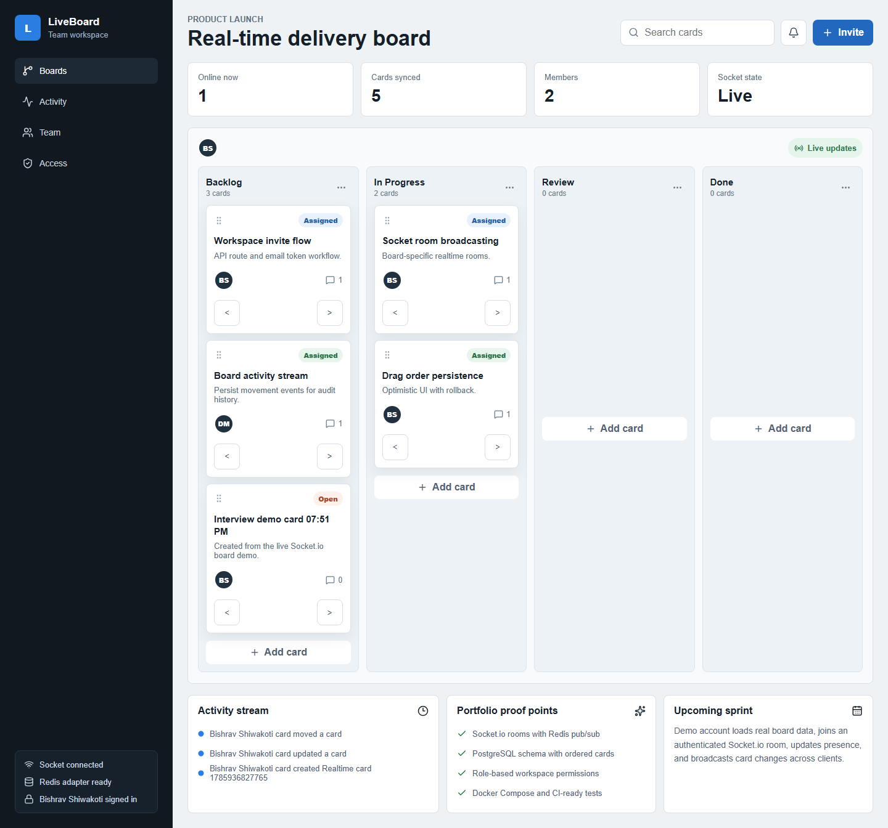
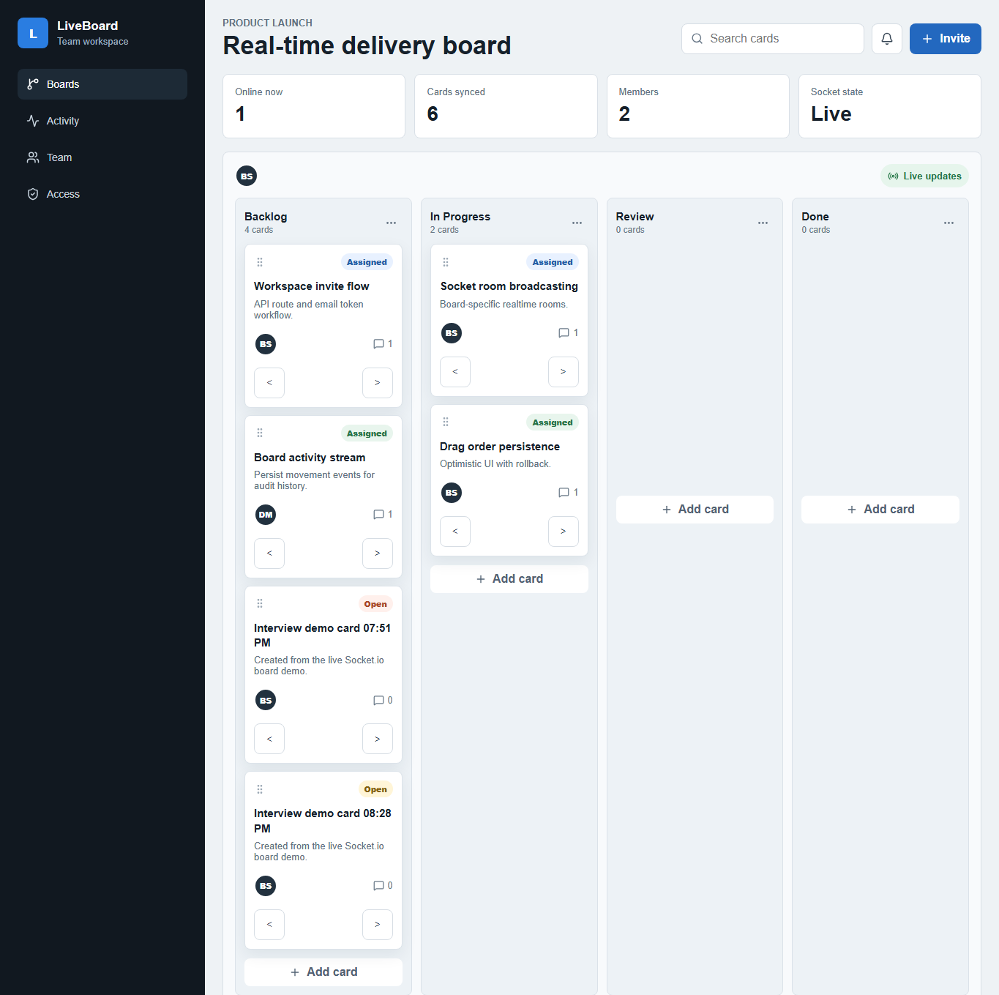
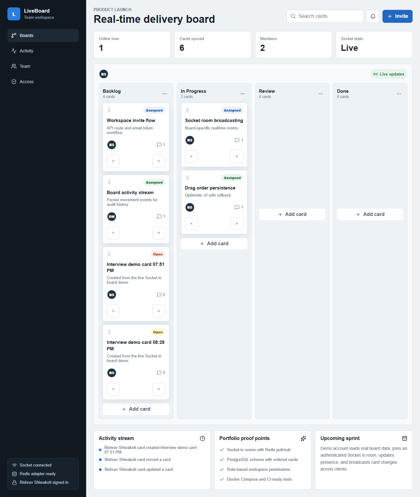

# LiveBoard

LiveBoard is a real-time collaborative task manager built to demonstrate production-style full-stack engineering: live board updates, workspace permissions, JWT auth, PostgreSQL persistence, Redis pub/sub, Docker-based local services, and CI-ready tests.

> Portfolio status: Phase 5 is complete. The frontend preview, Prisma schema, demo seed, JWT auth, REST APIs, permission checks, custom Socket.io server, board rooms, live presence, realtime card events, Redis pub/sub adapter, automated unit/API/socket tests, GitHub Actions CI, coverage tooling, docs, screenshots, Docker services, deployment health check, Railway Docker configuration, and live production demo are ready.

## Live Links

| Resource | Link |
| --- | --- |
| Live demo | [https://liveboard-production-6a27.up.railway.app](https://liveboard-production-6a27.up.railway.app) |
| Live deployment screenshot | [`docs/screenshots/live-deployment.png`](docs/screenshots/live-deployment.png) |
| Desktop preview | [`docs/screenshots/dashboard.png`](docs/screenshots/dashboard.png) |
| Mobile preview | [`docs/screenshots/mobile-board.png`](docs/screenshots/mobile-board.png) |
| Realtime screenshot | [`docs/screenshots/phase-3-realtime-board.png`](docs/screenshots/phase-3-realtime-board.png) |
| Two-client realtime proof | [`Client A`](docs/screenshots/realtime-client-a.png) / [`Client B`](docs/screenshots/realtime-client-b.png) |
| Architecture diagram | [`docs/architecture.mmd`](docs/architecture.mmd) |
| Schema diagram | [`docs/schema.mmd`](docs/schema.mmd) |
| API overview | [`docs/api-overview.md`](docs/api-overview.md) |
| Deployment runbook | [`docs/deployment.md`](docs/deployment.md) |

## Features

### Product Features

- Workspace dashboard for teams and boards.
- Trello-style board with columns and draggable cards.
- Live presence indicators for online teammates.
- Activity stream for board movement and collaboration events.
- Explicit login/register screen with demo workspace shortcut and logout.
- Productized Board, Activity, Team, and Access views.
- Workspace invites and role-based access for owner, admin, and member roles.

### Engineering Features

- Next.js App Router and TypeScript frontend.
- REST API for durable auth, workspace, board, column, card, and invite state changes.
- Custom Next.js HTTP server wrapper for Socket.io support.
- Authenticated Socket.io rooms for board-specific realtime updates.
- Redis pub/sub adapter for multi-instance socket event fanout.
- Live presence snapshots for joined board users.
- Realtime card create, update, move, and delete events backed by PostgreSQL persistence.
- Unit, API integration, and Socket.io integration tests with Vitest.
- GitHub Actions CI for Prisma generation, migrations, tests, lint, and production build.
- Production health endpoint at `GET /api/health` for deployment checks.
- Dockerfile and Railway configuration for running the custom Socket.io server in production.
- PostgreSQL schema for users, workspaces, boards, columns, cards, invites, and activity events.
- Docker Compose for local PostgreSQL and Redis.
- Portfolio checklist for GitHub readiness in [`docs/github-portfolio-standard.md`](docs/github-portfolio-standard.md).

## Architecture



## Schema Diagram



Full ERD: [`docs/schema.mmd`](docs/schema.mmd)

## API Route Overview

The backend uses REST endpoints for persistent state and Socket.io events for realtime board updates.

- Auth: `POST /api/auth/register`, `POST /api/auth/login`, `GET /api/auth/me`
- Health: `GET /api/health`
- Workspaces: `GET /api/workspaces`, `POST /api/workspaces`, `POST /api/workspaces/:workspaceId/invites`
- Boards: `GET /api/boards/:boardId`, `POST /api/workspaces/:workspaceId/boards`
- Columns: `POST /api/boards/:boardId/columns`, `PATCH /api/columns/:columnId`
- Cards: `POST /api/columns/:columnId/cards`, `PATCH /api/cards/:cardId`, `DELETE /api/cards/:cardId`
- Invites: `POST /api/workspaces/:workspaceId/invites`, `POST /api/invites/:token/accept`
- Realtime: `board:join`, `board:leave`, `presence:snapshot`, `card:create`, `card:update`, `card:delete`, `card:created`, `card:updated`, `card:moved`, `card:deleted`

Full route table: [`docs/api-overview.md`](docs/api-overview.md)

## Screenshots

### Live Deployment



### Desktop Preview



### Mobile Preview



### Phase 3 Realtime Board



### Two-Client Realtime Proof

Client A creates a card through Socket.io:



Client B receives the same card without refreshing:



## Environment Variables

Copy `.env.example` to `.env.local` and replace placeholder values.

```bash
cp .env.example .env.local
```

Important variables:

- `DATABASE_URL`
- `REDIS_URL`
- `JWT_SECRET`
- `NEXT_PUBLIC_APP_URL`

Never commit `.env.local` or real credentials.

## Local Setup

```bash
npm install
docker compose up -d
npm.cmd run db:migrate
npm.cmd run db:seed
npm.cmd run dev:socket
```

The Docker Postgres service maps to host port `55432` to avoid conflicts with any local PostgreSQL service already using `5432`.

Then open `http://localhost:3000`.

Use `npm.cmd run dev` only when testing the plain Next.js app without Socket.io. Realtime development uses the custom server wrapper through `npm.cmd run dev:socket`.

## Seed / Demo Credentials

These are safe demo accounts created by the seed script:

| Role | Email | Password |
| --- | --- | --- |
| Admin | `admin@liveboard.dev` | `LiveBoardDemo123!` |
| Member | `member@liveboard.dev` | `LiveBoardDemo123!` |

The seed script creates one workspace, one board, four columns, demo cards, and an activity event.

## Testing

Current local checks:

```bash
npm.cmd run db:generate
npm.cmd run test
npm.cmd run test:coverage
npm.cmd run lint
npm.cmd run build
```

Current automated coverage:

- Unit tests for slug generation, ordered positions, and invite token hashing.
- API integration tests for auth, board access, card creation, movement persistence, and private board authorization.
- Socket.io integration tests for authenticated room joins, presence snapshots, non-member rejection, realtime card creation, realtime movement broadcasts, and PostgreSQL persistence.
- GitHub Actions CI runs PostgreSQL, Redis, Prisma generation, migrations, tests, lint, and build on push and pull request.

Verified acceptance scenarios:

- Two users can log in with demo credentials.
- Authenticated users can create workspaces, boards, columns, cards, and invites through REST APIs.
- A card moved through the API persists its target column and position.
- Card order persists after reload.
- Authenticated Socket.io users can join board rooms and receive presence snapshots.
- Card create/update/move/delete socket events persist to PostgreSQL and broadcast to joined clients.
- Redis adapter connects when `REDIS_URL` is configured.
- Unauthorized users cannot access private workspaces.

## Deployment

Recommended deployment:

- App service: Railway Docker deployment running `npm run start:socket`.
- PostgreSQL: Railway Postgres, Supabase, or Neon.
- Redis: Railway Redis or Upstash.
- Secrets: deployment provider environment variables only.
- Health check: `GET /api/health`.

LiveBoard uses a custom `server.ts` wrapper because Next.js App Router cannot host Socket.io as a native serverless route. Railway is the recommended single-service deployment target for the full realtime demo. Vercel can host the Next.js REST/frontend layer, but a separate long-running Socket.io service would still be required for realtime collaboration.

Production demo: [https://liveboard-production-6a27.up.railway.app](https://liveboard-production-6a27.up.railway.app)

Full deployment runbook: [`docs/deployment.md`](docs/deployment.md)

## Roadmap

- Phase 1 complete: frontend preview, documentation, env example, Docker Compose, screenshots, lint, and build.
- Phase 2 complete: auth, database schema, seed script, workspace APIs, board/column/card APIs, invite APIs, and permission checks.
- Phase 3 complete: custom Socket.io server wrapper, authenticated board rooms, Redis pub/sub, presence, realtime card create/update/move/delete, and frontend socket integration.
- Phase 4 complete: unit tests, API integration tests, Socket.io integration tests, coverage command, GitHub Actions CI, realtime proof screenshots, and README polish.
- Phase 5 complete: production health endpoint, Dockerfile, Railway configuration, deployment runbook, deployed Railway demo, production Postgres/Redis services, startup migrations, demo seed data, and public health verification.
